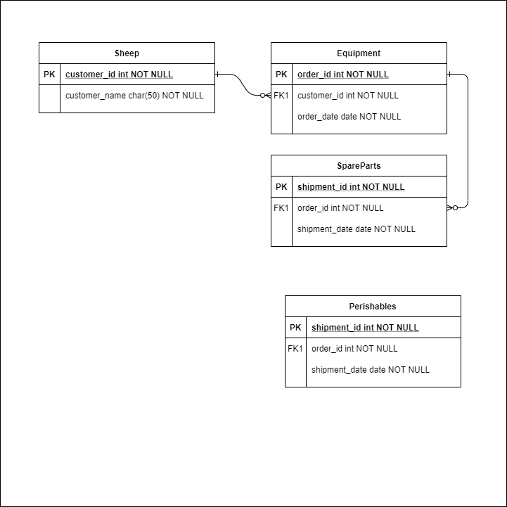

# Sample SheepFarm
A demo application to demonstrate a DynamoDB Polymorphic Table serving a Next.js application.

The service requires a local DynamoDB instance running which needs preloaded data from DynamoDB workbench.

#### Required Local DynamoDB
The project requires a local DynamoDB which can be executed through either:

```
sudo docker run  -p 8000:8000 amazon/dynamodb-local -jar DynamoDBLocal.jar -sharedDb

or 

yarn dockerDev
```

#### Execute Nodemon to run the server

```
ts-node --project tsconfig.server.json server/index.ts

or 

yarn dev
```
#### DynamoDB WorkBench File
We have a DynamoDB Workbench file that can be used to preload sample data into the local DynamoDB file.

[WorkBench FIle](./architecture/sheepfarm.json)

#### SheepFarm Entity Relationship Diagram
