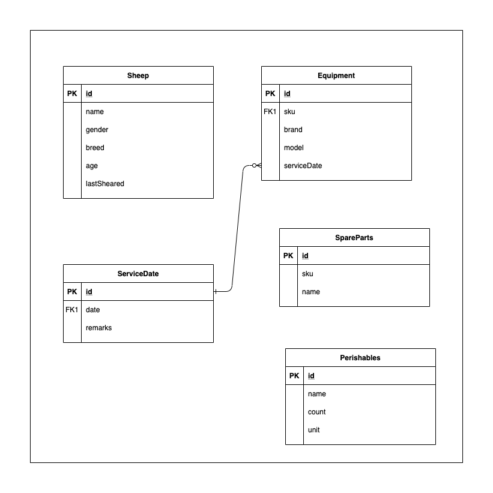

# SheepRP - A Sheep Resource Planning System

There are a lot of good resources out there for DynamoDB Single Table Designs (Polymorphic Tables) but I was looking for something which would be able to demonstrate a fully working application that reads directly off a DynamoDB table locally. As AWS kindly provides the DynamoDB in docker format we can now do this. In practice you may have an API and more complex infrastructure serving this, most of this is for demonstration purposes. As we all dream of being a Sheep Farmer in the Australia Outback the SheepRP steps in :)

The SheepRP is meant to be a fully included application that you can run locally and expermient with on your own. It has been tested on the Linux so mileage may vary.

The requirements are:
* installed docker
* yarn
* nodejs runtime

## Required Local DynamoDB
The project requires a local DynamoDB which can be executed through either:

```
yarn dynamo

or 

sudo docker run  -p 8000:8000 amazon/dynamodb-local -jar DynamoDBLocal.jar -sharedDb
```

## Run the Next.js server

Once the Data is preloaded you can then run the next.js server or skip the above step and just run yarn devDb which will also preload the data at the same time.

```
yarn dev

or 

yarn devDb  (to preload the DynamoDB at the same time)
```

### Designing DynamoDB tables 

With DynamoDB there are some design principles to follow. You should model your schema into a Diagram, comonly done as an Entity Relationship Diagram. Then you should describe some access patterns. In our case we can come up with these access patterns:

* I want to be able to see all my sheep on the farm
* When they were sheared
* all my farm equipment
* all the perishables on the farm

With this we can then start modelling something onto DynamoDB Workbench. I've provided a sample Workbench file which we use to process the contents into our local DynamoDB model https://docs.aws.amazon.com/amazondynamodb/latest/developerguide/workbench.html


### DynamoDB WorkBench File
We have a DynamoDB Workbench file that can be used to preload sample data into the local DynamoDB file.

[WorkBench FIle](./architecture/sheepfarm.json)

### SheepFarm Entity Relationship Diagram
